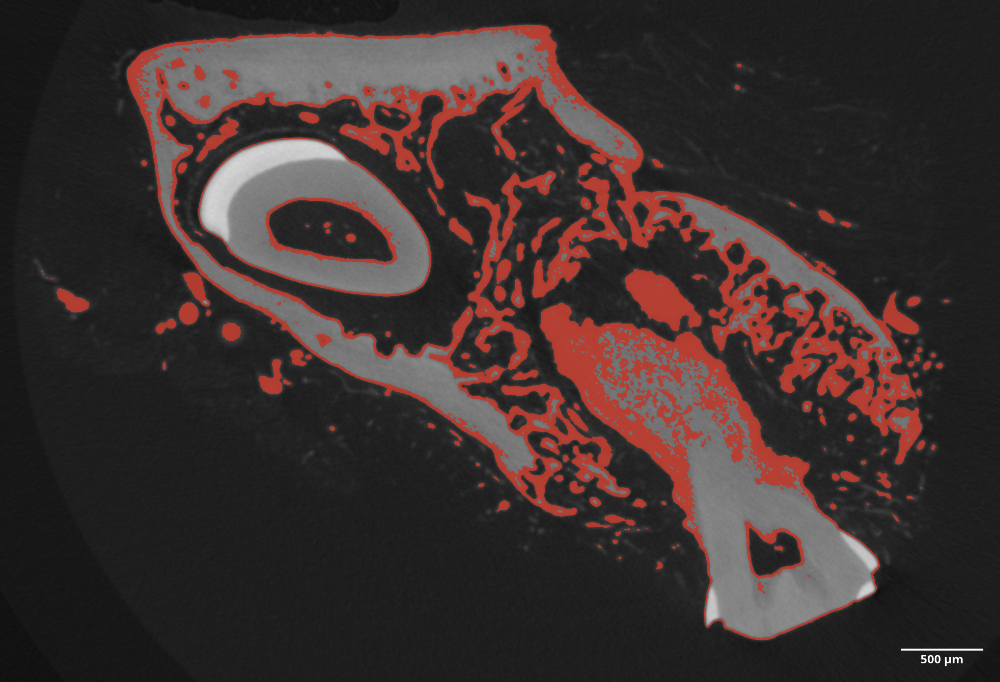

# Reviewer 1

> Dear Authors, thank you for the detailed revision you provided.
> Reading the revised manuscript, it is clear that it has been improved in depth compared to the first draft.
> For example, the literature cited in the Introduction is now much more complete following this revision.

We thank the anonymous reviewer for recognizing the work we have put into revising our manuscript.

> Nevertheless, some conceptual doubts remain about your study, which are also supported by the answers you provided to the other reviewer's questions.
> In particular, it is not clear what the purpose of this study is; is it a methodological study?
> Or an applicative study with respect to a certain diagnostic or bone tissue engineering problem?
> From the answers you provided in the first round, you repeatedly reiterated that the goal would seem to be methodological for an extended applicability in the preclinical field on animal models.

The reviewer is correct about our study focusing on extended applicability in preclinical research.

> In this case, therefore, the true methodological purpose of the study must be clarified starting from the title, which does not focus on "microvasculature in bone and peri-implant tissues" but proposes different resolutions and different bone sites of interest.

The main focus of our study is on microvasculature, which includes, but is not limited to the finest microvessels, the capillaries.
We agree that in certain shown datasets we can only resolve some segments of the microcirculatory system.
Nonetheless, to accomodate the reviewers input we adapted the title of our manuscript and do not mention the *micro*vasculature in the title anymore.

> in fact, where preclinical or clinical problems related to the bone tissue to be implanted should be considered, I reiterate that it would be necessary to focus the interest on small vessels, i.e. capillaries, even by narrowing the field of view as proposed in previous studies in the literature; in fact, the problems connected to implant failures concern the vascular vectors closest to the implant surface, which are precisely the microvascular vectors.
> Conversely, for the example you provided, you considered, in favor of a larger field of view, a resolution too low to have a diagnostic or prognostic meaning in the implantology field.
> It is true that in another example you used higher resolutions also resolving the microvessels, but in this last case the preclinical problem was different.
> I would therefore like the work to be truly reformulated as a methodological study and, as correctly requested by the other reviewer, to provide at least some quantitative data demonstrating the reliability of the proposed contrast medium at different resolutions, up to the microvasculature.

The underlying idea of our manuscript was to show the applicabiliy of tomographic imaging of μAngiofil instilled samples on a multitude of microCT scanners in a multitude of various bone sites in preclinical models.
Our proposed method succeeds to visualize the vasculature down to the resolution level of the tomographic scan.
We also suggest a refined scanning method for samples in which an straightforward segmentation of the instilled vasculature is not possible.
We believe to have convincigly shown that our approach enables to study quantitative aspects of the vasculature.
Quantitative analysis itself is *not* the focus of our present manuscript, therefore we kindly refrain from adding such data.

> Another doubt remains on Fig. 7.
> In the shown slice the threshold segmentation is already possible using a single energy; since you say that this is not always possible in the whole 3D dataset, I propose to show another slice to make the concept clearer.

To answer the following remark, we present a sample segmentation from another location in the dataset, obtained by gray value thresholding.
As one can see, this approach does *not* separate the vasculature cleanly from other structures, such as thinner bone and bone surface.
We do not think it would benefit the manuscript to include such image as it would draw the attention of the reader from the proposed method itself.
We introduced this figure and dual-energy approach into our manuscript to give reader the ways to overcome potential segmentation difficulties.
If the reader, in his study, can successfully perform segmentation using single energy scan - they are more than welcome to do it.
We have adapted the corresponding part of the text to make this message more clear to the reader.

